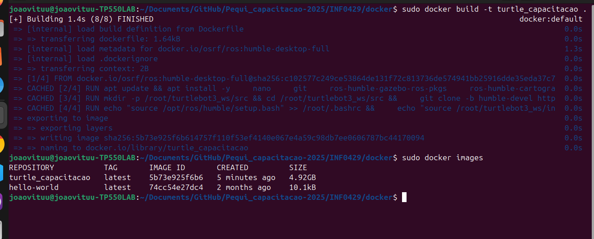

# ⚙️ Buildando Imagem TurtleBot

## Build
Execute o código no local onde a imagem está:
```bash
sudo docker build -f turtle_capacitacao .
```
obs: tambem pode se buildar com o caminho para imagem no local de "."


Para listar as imagens no dispositivo:
```bash
sudo docker images
```

