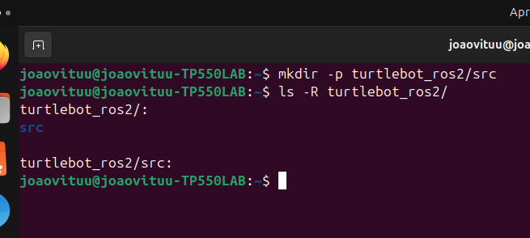
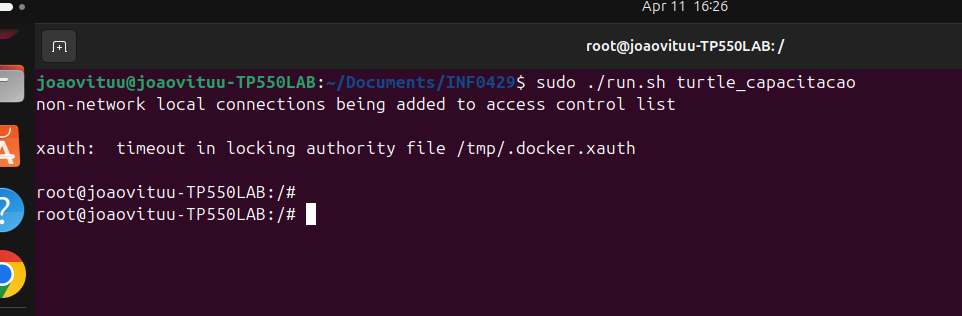
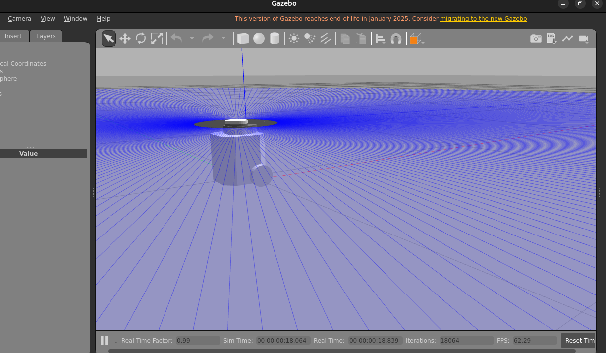
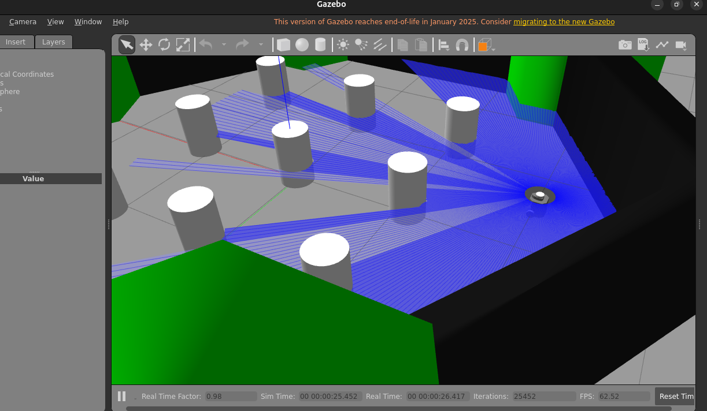
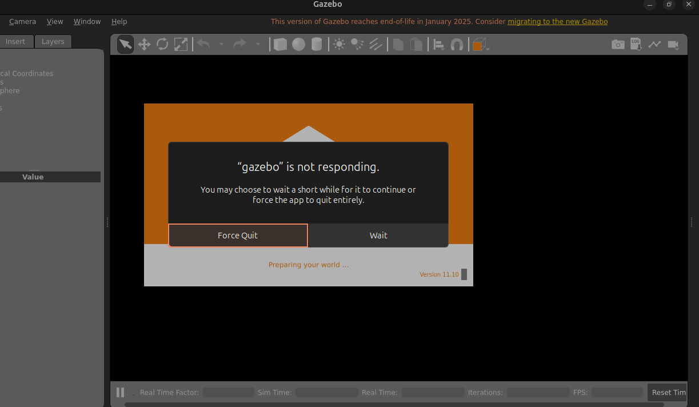

# Simulação do Turtlebot3

## Configuração do sistema 

### Criando um workspace para ROS2
```bash
mkdir -p turtlebot_ros2/src
```



### Iniciando o conteiner do Turtlebot
No diretório do INF0429 execute o código:
```bash
sudo ./run.sh turtle_capacitacao
```


### Modelo do Turtlebot3
O padrão é o modelo waffle
```bash
export TURTLEBOT3_MODEL=burger  # Opções: burger, waffle, waffle_pi
```

## Simulação no Gazebo

### Mundo Vazio
```bash
ros2 launch turtlebot3_gazebo empty_world.launch.py
```
#### Modelo Burger:


### Mundo Padrão
```bash
ros2 launch turtlebot3_gazebo turtlebot3_world.launch.py
```

#### Modelo Burger:


### Mundo Casa
```bash 
ros2 launch turtlebot3_gazebo turtlebot3_house.launch.py
```

#### Modelo Burger:
ERRO!


## Simulação com Fake Node
```bash
ros2 launch turtlebot3_fake_node turtlebot3_fake_node.launch.py
```
#### Modelo Burger:

